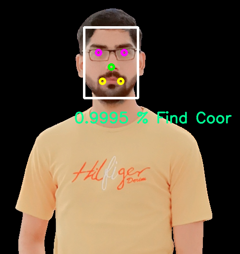

# DeepFace Face Feature Analysis
This is a web-based application that provides deep analysis of facial features using a deep learning model. 
The application is built using Flask and Swagger API, making it easy to use and accessible to everyone.

## Features
* Facial feature analysis: The deep learning model can analyze facial features such as eyes, nose, mouth, and facial contours to provide a comprehensive analysis of the user's face.
* User-friendly interface: The application uses Swagger API, providing a user-friendly interface that makes it easy to understand the results.
* Fast and accurate: The deep learning model has been trained on a large dataset, making it fast and accurate in providing the analysis.

## Requirements
* Flask
* Swagger UI
* TensorFlow
* Keras

## Installation
*  step 1: create a virtual environment
    -   $ python3 -m venv env
    -   $ source env/bin/activate
*  step2: clone the repository
    -   git clone https://github.com/AMujtaba57/face_feature_analysis.git
*  step3: install requirements
    -   $pip install -r requirements.txt
*  step4: run the app
    -   $python main.py
*  step5: access API
    -   Open your web browser and go to http://localhost:5000/
Use the Swagger API to perform facial feature analysis.

## Documentation
The documentation for the application is available in the docs folder. It provides a comprehensive explanation of the application, 
its features, and how to use it.

## Output

## Contacts
For any questions or feedback, please contact us at [ahmad-mujtaba.com](http://www.ahmad-mujtaba.com/).